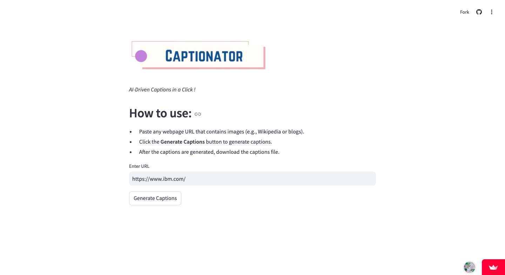
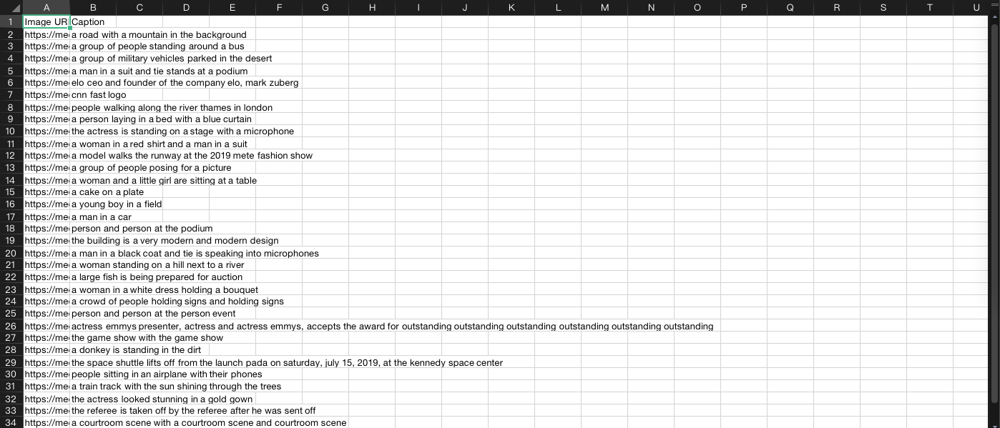

# Captionator

An AI-powered tool that scrapes images from a webpage and generates captions locally for each image using the BLIP model. This project uses [Gradio](https://gradio.app/) to create an interactive web interface.

## Objective

**Captionator** is designed to help users automatically generate descriptive captions on their local machines for images found on a webpage. This tool can be useful in the following contexts: 
1. **Content Creation**: Content creators, bloggers, or social media managers can use this tool to quickly generate captions for images on their websites or blogs. It saves time and adds valuable metadata to images. 
2. **Accessibility**: The captions generated can be used to provide alt text for images, helping visually impaired users understand the content on a webpage. 
3. **Image Dataset Creation**: Researchers and data scientists can leverage this tool to build datasets with image captions, which can be useful for training machine learning models in computer vision tasks. 
4. **Web Scraping & Automation**: This tool automates the process of scraping images and generating captions, which can be useful for businesses or organizations that need to collect large amounts of image data from various websites.

## How It Works

1. **Input**: Paste the URL of any webpage containing images.
2. **Processing**: The app scrapes all images from the page, processes them using the BLIP (Bootstrapping Language Image Pretraining) model, and generates captions.
3. **Output**: You can download the generated captions as a `.csv` file containing the image URLs and their respective captions.

## Features

- Scrapes all images from the given URL.
- Generates captions for each image using an AI model (BLIP).
- Download captions in `.csv` format for further use.
- Interactive web interface powered by [Gradio](https://gradio.app/).

## Requirements

- Install dependencies using `pip install -r requirements.txt`

## Setup and Installation

1. Clone the repository:

    ```bash
    git clone https://github.com/bushraqurban/Captionator.git
    cd captionator
    ```

2. Create a virtual environment and activate it (optional but recommended):

    ```bash
    python3 -m venv venv # On Mac 
    source venv/bin/activate  # On Windows
    ```

3. Install the required dependencies:

    ```bash
    pip install -r requirements.txt
    ```

4. Run the application:

    ```bash
    python3 app.py # On Mac
    python app.py # On Windows
    ```

    This will launch the app in your browser.

## How to Use



 1. Paste any webpage URL that contains images (e.g., Wikipedia or
    blogs).
 2. Click the **Generate Captions** button to generate captions.
 3. After the captions are generated, download the captions file with `.csv` formate.

## Example

Here’s an example of how the `.csv` file will look like after running the tool:




## Future Improvements

- **Error Handling**: Improve error handling for more robust scraping (e.g., handle broken links or missing images).
- **User Interface**: Enhance the user interface for better interaction (e.g., adding image previews alongside captions).
- **Expand Functionality**: Add support for other content formats (e.g., videos) and multiple languages.

## License

This project is licensed under the MIT License - see the [LICENSE](LICENSE) file for details.

## Project Acknowledgment and Enhancements

This project was inspired by the [IBM AI Developer Professional Certificate](https://www.coursera.org/professional-certificates/applied-artifical-intelligence-ibm-watson-ai) course guided project. I have further enhanced it by adding several custom features, including:

- A user-friendly interface that allows users to interact with the app directly without needing to run Python scripts.
- An improved output format that generates captions in a CSV file with a table structure, making it more organized and user-friendly.

## Technologies Used:
- [BLIP Model](https://github.com/huggingface/transformers) for image captioning.
- [Gradio](https://gradio.app/) for the easy-to-use interface framework.
- [BeautifulSoup](https://www.crummy.com/software/BeautifulSoup/bs4/doc/) for web scraping.
